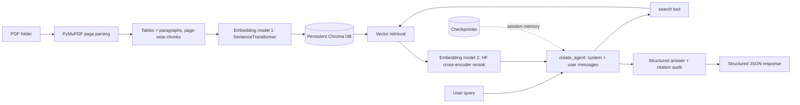

# Financial Reports RAG API

A FastAPI application for asking grounded questions over 20 quarterly financial
PDFs from Apple, Amazon, Intel, Microsoft and NVIDIA. Ingestion parses the PDFs
page-wise (tables and paragraphs separately) into a Chroma vector store. Queries
are answered by a LangChain agent that retrieves, reranks with a second model,
and returns a schema-validated, cited answer.

## Project layout

```text
main.py                          FastAPI app and startup wiring
app/
  config.py                      Environment-driven settings
  errors.py                      Domain errors mapped to HTTP responses
  schemas.py                     Pydantic request/response models
  prompts/
    prompts.py                   Versioned prompts and message builder
  ingestion/
    ingestion.py                 IngestionService (folder -> vector store)
    pdf_parser.py                Page/table/paragraph-aware PDF parsing
    helpers.py                   Hashing, cleaning, filename metadata
  search/
    vector_store.py              Embeddings + Chroma (VectorStore)
    reranker.py                  HuggingFace cross-encoder (Reranker)
    search.py                    SearchService (retrieve + rerank)
  agent/
    agent.py                     RAGAgent built with create_agent
  router.py                      /ingest, /query and /health endpoints
financial_rag_assignment.ipynb  Exploration and evaluation notebook
data/                            Source PDFs
requirements.txt                Python dependencies
```

## Architecture



The agent is created with `create_agent` (LangChain) and uses role-based
messages: a system prompt defines behaviour, the user message carries the
question and known filters, and the model's tool/AI messages drive retrieval. An
in-process checkpointer keeps memory per `session_id`.

## Two models

- **Embedding model (vector store):** `all-MiniLM-L6-v2` embeds chunks for
  semantic retrieval. Swap for OpenAI/Azure OpenAI embeddings if needed.
- **Reranker model (HuggingFace):** `cross-encoder/ms-marco-MiniLM-L-6-v2`
  rescores the retrieved candidates for sharper ordering before generation.

Retrieval pulls a wider candidate set (`RETRIEVE_CANDIDATES`) and the reranker
narrows it to `TOP_K`.

## Setup

Python 3.11 is recommended. The agent requires an OpenAI API key.

```powershell
python -m venv .venv
.\.venv\Scripts\Activate.ps1
pip install -r requirements.txt

$env:OPENAI_API_KEY="your-key"
$env:OPENAI_MODEL="gpt-4.1-mini"   # optional
uvicorn main:app --reload
```

Swagger UI is available at <http://127.0.0.1:8000/docs>. The first start
downloads the embedding and reranker models.

## API

### Ingest PDFs

`POST /ingest` recursively reads PDF files from the supplied folder. SHA-256
hashes make repeated ingestion idempotent.

```powershell
Invoke-RestMethod -Method Post http://127.0.0.1:8000/ingest `
  -ContentType "application/json" `
  -Body '{"folder":"data"}'
```

```json
{
  "pdfs_found": 20,
  "ingested": 20,
  "skipped": 0,
  "failed": 0,
  "chunks_in_store": 1240,
  "documents": [{"filename": "2023 Q3 MSFT.pdf", "status": "indexed", "chunks": 63}]
}
```

### Ask a question

`POST /query` runs the agent: it retrieves, reranks, and returns a structured,
cited answer. Optional request filters are `company`, `year`, `quarter` and
`top_k`; `session_id` enables multi-turn memory.

```powershell
Invoke-RestMethod -Method Post http://127.0.0.1:8000/query `
  -ContentType "application/json" `
  -Body '{"query":"What drove Microsoft revenue growth in Q3 2023?","session_id":"demo"}'
```

```json
{
  "query": "What drove Microsoft revenue growth in Q3 2023?",
  "session_id": "demo",
  "requested_filters": {"company": "MSFT", "year": 2023, "quarter": "Q3"},
  "response": {
    "answer": "...",
    "supporting_evidence": ["..."],
    "sources": [
      {"document_name": "2023 Q3 MSFT.pdf", "page": 2, "chunk_id": "...-p002-t000", "quote": "..."}
    ],
    "confidence": 0.7,
    "limitations": []
  },
  "retrieval_diagnostics": [
    {"rank": 1, "document": "2023 Q3 MSFT.pdf", "page": 2, "chunk_type": "text",
     "vector_score": 0.71, "rerank_score": 8.4, "preview": "..."}
  ],
  "latency_seconds": 0.9
}
```

`GET /health` returns index counts, both model names and agent availability.

## Assignment coverage

**Document processing & embeddings** — page-wise PyMuPDF parsing keeps tables and
paragraphs as separate chunks; conservative cleaning retains financial
punctuation; local normalized embeddings give privacy, low cost and
reproducibility.

**Vector storage & retrieval** — Chroma persists vectors and metadata; semantic
search supports company/year/quarter filters; a HuggingFace cross-encoder
reranks candidates (retrieval optimization).

**Response generation** — retrieved text is treated as untrusted data; the agent
answers only from context, returns a Pydantic-validated structure (answer,
supporting evidence, sources, confidence, limitations), and every quote is
audited against the retrieved chunk. `create_agent` provides the agentic
tool-using workflow with session memory.

**Evaluation** — the notebook contains earnings, risk and strategy questions with
retrieval and grounding metrics as a smoke test.

## Design choices and trade-offs

- **Local embeddings + HF reranker:** private and cheap; a finance-tuned or hosted
  embedding model would likely improve recall.
- **Chroma:** good for a demo; Azure AI Search or another managed vector database
  adds scaling, security, backups and monitoring.
- **PyMuPDF:** fast for digital PDFs; scanned pages and complex tables need
  OCR/layout extraction such as Azure Document Intelligence.
- **In-process memory:** fine for one process; use a Postgres/Redis checkpointer
  for durable memory across replicas.
- **Async I/O:** blocking model and database calls run in worker threads so the
  API stays responsive.

## Limitations and next steps

Financial PDFs contain multi-column layouts, tables, charts and repeated legal
language. Next steps: layout-aware extraction and OCR, finance-tuned embeddings,
hybrid keyword search, authentication and rate limiting, tracing, durable graph
memory, and a larger human-reviewed evaluation set.
